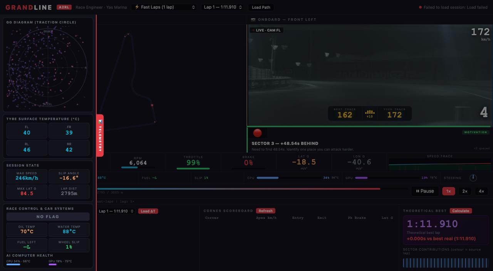
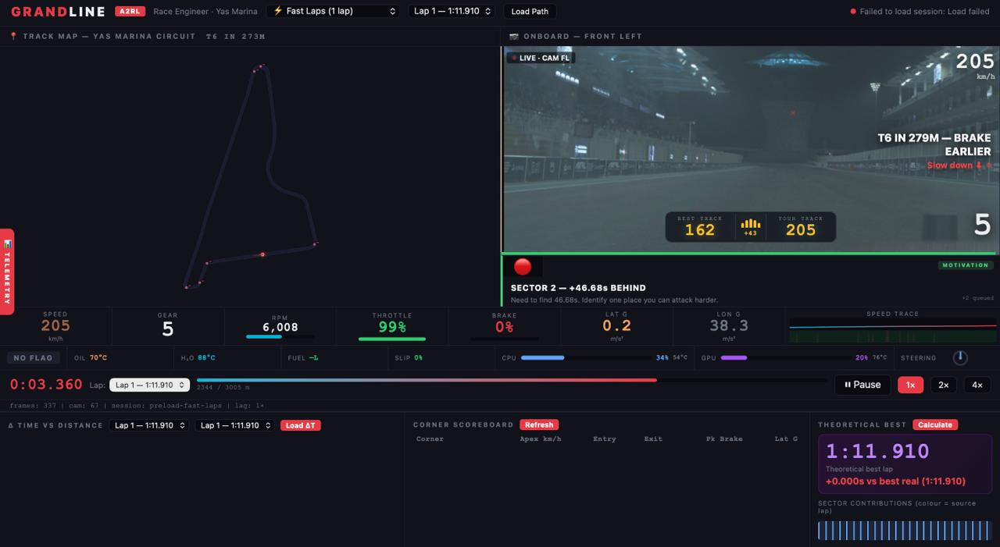

# GRANDLINE — AI Race Engineer 🏁🧠

> **Real autonomous racing telemetry. Real engineering analysis. Real-time AI coaching.**

GRANDLINE is a compact race engineering workspace built on the **A2RL Yas Marina autonomous racing dataset**, developed for the **Constructor GenAI Hackathon 2026 — Autonomous Track**. 🏎️📡

It transforms raw racing telemetry into a judge-friendly, engineering-grade dashboard for replay, comparison, corner analysis, tyre monitoring, and AI-assisted debrief. 🎯

### Demo-ready preload flow 🚀
The three hackathon sessions are automatically loaded at startup so the product is immediately usable in a demo environment.

---

### Demo Screenshots 📸

### Main dashboard


A single-screen engineering workspace combining:
- track map
- onboard replay
- live telemetry
- lap state
- lower analysis panels

### Telemetry + systems panel


Expanded engineering view with:
- GG diagram
- tyre temperatures
- session stats
- car systems
- AI computer health

---

---

## Overview 🌌

Modern racing datasets are extremely rich, but most demos either:
- show raw numbers with no narrative, or
- generate generic commentary disconnected from the actual driving data.

GRANDLINE closes that gap. 🧭

It ingests real autonomous racing telemetry, reconstructs laps, aligns them by **distance along the circuit**, detects corners, evaluates braking and grip behavior, and overlays AI coaching directly on top of replay and analysis views.

The result is a system that feels like a lightweight **AI race engineer workstation** rather than a static analytics page. 🛠️⚡

---

## Why GRANDLINE 🧠🏎️

GRANDLINE was designed to make high-frequency racing telemetry usable in a live setting.

It is especially useful for:

- **lap comparison**
- **distance-based performance analysis**
- **corner-by-corner inspection**
- **grip and tyre monitoring**
- **AI-assisted debrief generation**
- **judge-friendly replay demos with real data**

Instead of comparing laps by timestamp, GRANDLINE aligns them by **track position**, which is the correct race-engineering approach when you want to understand where and why time is gained or lost. 📍

## How to Run 🏁💻

Get **GRANDLINE** running locally in just a few minutes.

> [!IMPORTANT]
> GRANDLINE expects the provided hackathon dataset to be placed in a specific local folder structure before startup.

### 1) Clone the repository

```bash
git clone https://github.com/m3h3mm3dd/grandline-ckl-hackathon
cd grandline-ckl-hackathon
```

### 2) Install dependencies

```bash
pip install -r requirements.txt
```

### 3) Add the hackathon data

Create the following folder structure inside the project root:

```text
grandline-ckl-hackathon/
├── data/
│   └── hackathon/
│       ├── hackathon_good_lap.mcap
│       ├── hackathon_fast_laps.mcap
│       ├── hackathon_wheel_to_wheel.mcap
│       └── yas_marina_bnd.json
```

> [!NOTE]
> GRANDLINE automatically detects this folder and preloads the sessions at startup. No extra configuration is required.

### 4) Start the backend

Run this from the project root:

```bash
python -m uvicorn backend.main:app --reload --host localhost --port 8000
```

Backend will be available at:

```text
http://localhost:8000
```

Useful backend check:

```text
http://localhost:8000/preloaded
```

### 5) Start the frontend

Open a **second terminal** in the same project folder and run:

```bash
python -m http.server 5500
```

Frontend will be available at:

```text
http://localhost:5500/dashboard.html
```

### 6) Open the dashboard

Once both servers are running, open:

```text
http://localhost:5500/dashboard.html
```

---

## Key Features ⚙️🔥

### Distance-normalised lap comparison
Compare two laps at the same point on the circuit instead of the same time index.

This reveals:
- braking differences
- corner entry losses
- apex speed variations
- exit traction advantages
- where time is carried down the next straight

### Per-corner analysis 🌀
Every detected corner is broken down into meaningful performance phases.

Metrics include:
- entry speed
- apex / minimum speed
- exit speed
- peak brake
- lateral load
- throttle behavior around the corner

### GG diagram 📈
Visualizes the traction envelope and how aggressively the car is using available grip.

### Tyre thermal analysis 🌡️
Tracks tyre temperatures through the lap and surfaces:
- overheating
- cold-start behavior
- temperature trend evolution

### AI race engineer 🤖
Generates short, scenario-aware engineering feedback grounded in:
- lap structure
- corner behavior
- telemetry events
- tyre state
- comparison context

### Live replay with telemetry 🎥
Replay a lap while seeing:
- onboard camera
- live telemetry state
- track position
- AI coaching overlays
- sector context
- comparative references

## Dataset & Provenance 🗂️

GRANDLINE is built on the **A2RL autonomous racing telemetry dataset for Yas Marina Circuit (Abu Dhabi)** provided during the **Constructor GenAI Hackathon 2026**. 🌍🏁

### Dataset contents
The shared hackathon package includes:

- **3 MCAP files** covering different race scenarios
- **state estimation telemetry**
- **onboard camera streams**
- **GPS + IMU**
- **wheel speeds**
- **brake pressures**
- **tyre temperature / tyre pressure**
- **wheel loads**
- **ride height / suspension-related signals**
- **track boundary data** via `yas_marina_bnd.json`
- **ROS 2 custom message definitions**

### Sessions used in GRANDLINE

| Scenario | Session ID |
|----------|------------|
| Good lap (reference) | `preload-good-lap` |
| Fast laps | `preload-fast-laps` |
| Wheel-to-wheel race | `preload-wheel-to-wheel` |

### Dataset package used during development

`https://eu1-s3.virtuozzo.com/dev-auto-mobility-data/hackathon.tar.xz`

---

## What Makes It Technically Interesting 🔬

GRANDLINE is not a static UI over canned values.

The system performs actual telemetry processing, including:

- MCAP decoding
- lap detection
- track-distance normalization
- corner detection and calibration
- live replay synchronization
- engineering metric extraction
- AI prompt construction grounded in telemetry context

That means the dashboard is driven by real session data rather than hardcoded demo labels. 🧩

---

## Architecture 🏗️

```text
backend/
  main.py               FastAPI app + startup preload

grandline/
  routers/
    sessions.py         MCAP upload + session lifecycle
    analysis.py         Telemetry analysis endpoints
    coach.py            AI debrief / question endpoints
    stream.py           Live replay streaming endpoints

  services/
    mcap_reader.py      MCAP + message decoding
    lap_detector.py     Lap segmentation
    corner_detector.py  Corner detection + GPS calibration
    metrics_engine.py   GG diagram, delta, tyres, comparisons
    ai_coach.py         AI race engineer prompt construction
    session_store.py    In-memory session registry
    preload.py          Startup preload for hackathon sessions

  models/
    schemas.py          Typed response models

data/
docs/
README.md
requirements.txt
dashboard.html